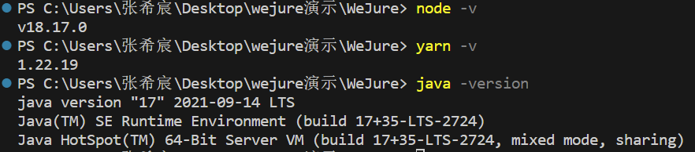
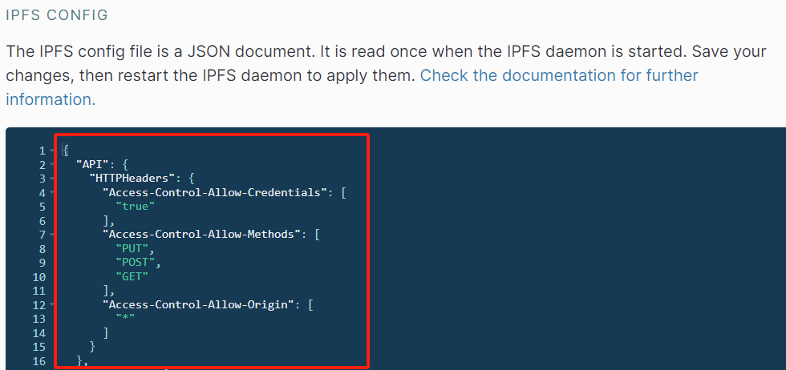
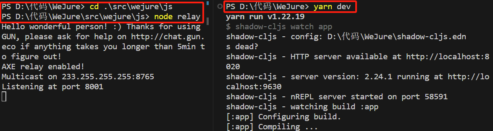

{:title "Step by Step Guide"
 :layout :page
 :page-index 3
 :navbar? true
 :home? true}

 ### Verify installation of the required software
```
- Node.js     node -v 
- Yarn        yarn -v
- Java SDK    java -version
```



### configure IPFS
go to setting modify the configure file
```
"API": {
        "HTTPHeaders": {
            "Access-Control-Allow-Credentials": [
                "true"
            ],
            "Access-Control-Allow-Methods": [
                "PUT",
                "POST",
                "GET"
            ],
            "Access-Control-Allow-Origin": [
                "*"
            ]
        }
    }
```


### download dependencies
```
command: yarn
output if first time:                output if already downloaded:  
yarn install v1.22.19                yarn install v1.22.19               
[1/4] Resolving packages...          [1/4] Resolving packages...
[2/4] Fetching packages...           Done in 0.40s.
[3/4] Linking dependencies...
[4/4] Building fresh packages...
success Saved lockfile.
Done in 10.63s.
```

### set up server
first navigate to src/wejure/js 
in terminal and run node relay to start a relay server for synchronizing data in gunDB. 
Next, run a local IPFS client to host IPFS. 
In the root directory, start a local server by the command yarn dev.


### visit WeJure [localhost:8020](localhost:8020) 